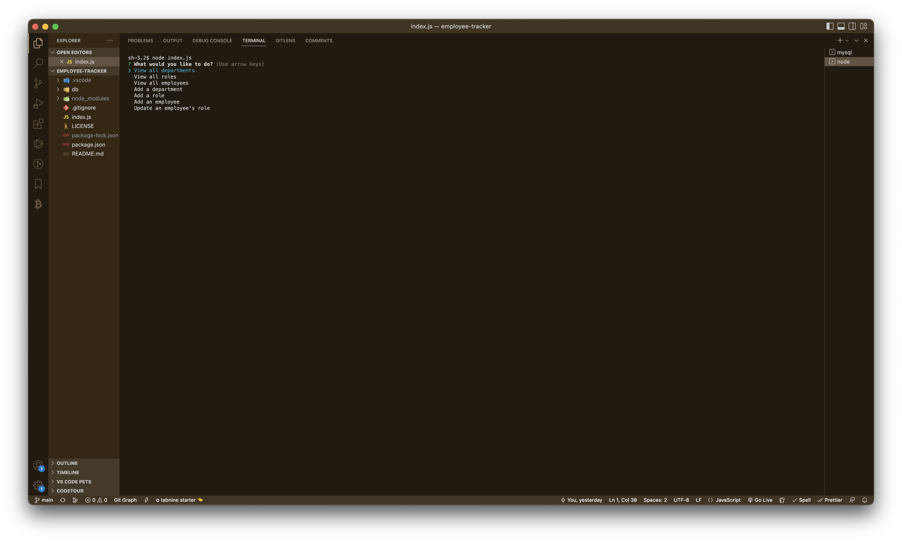
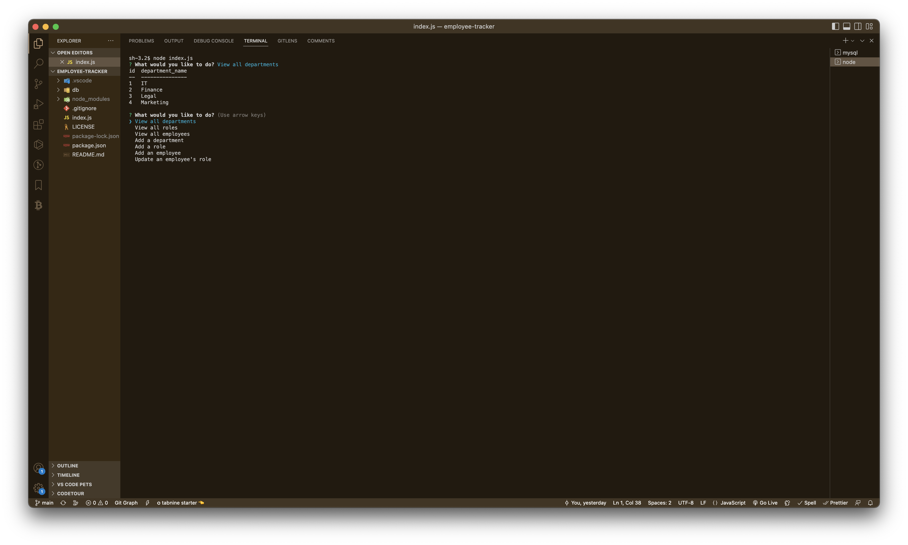
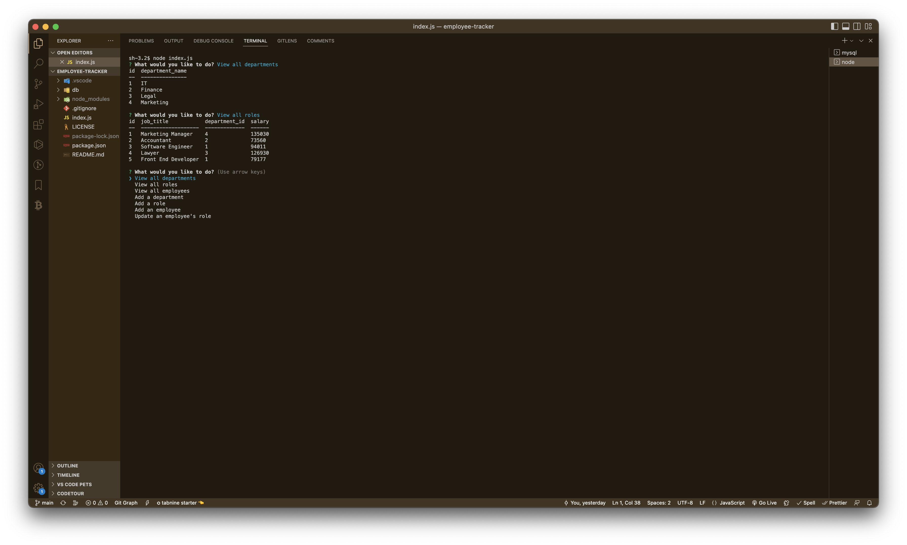
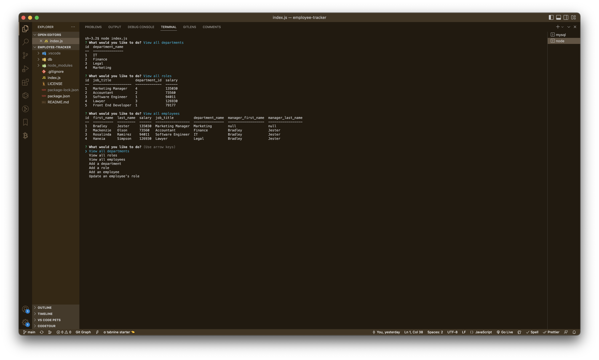
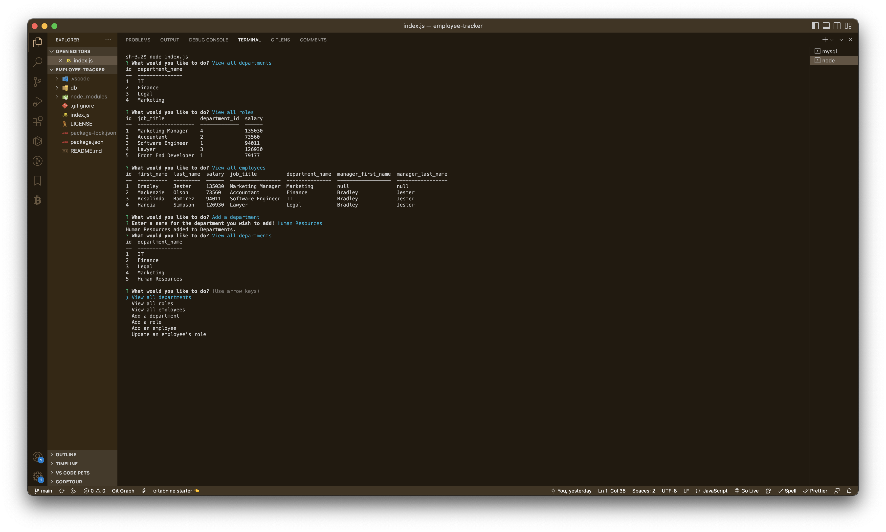
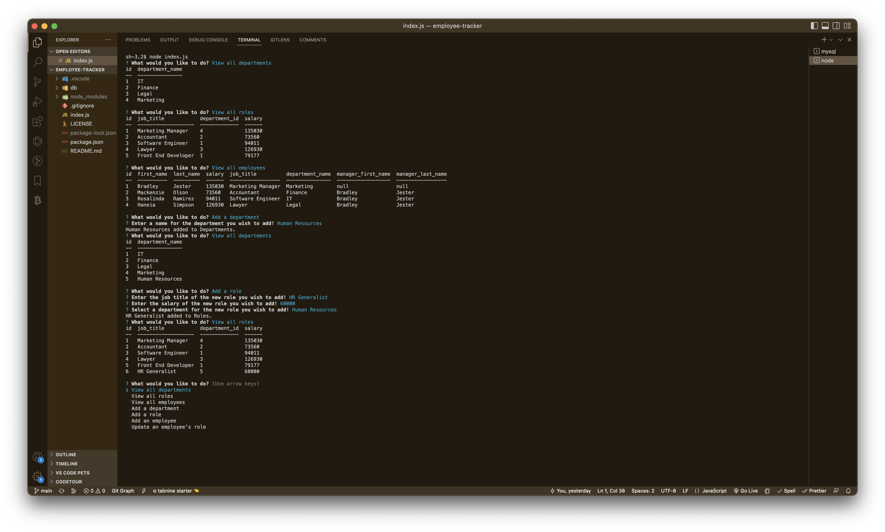
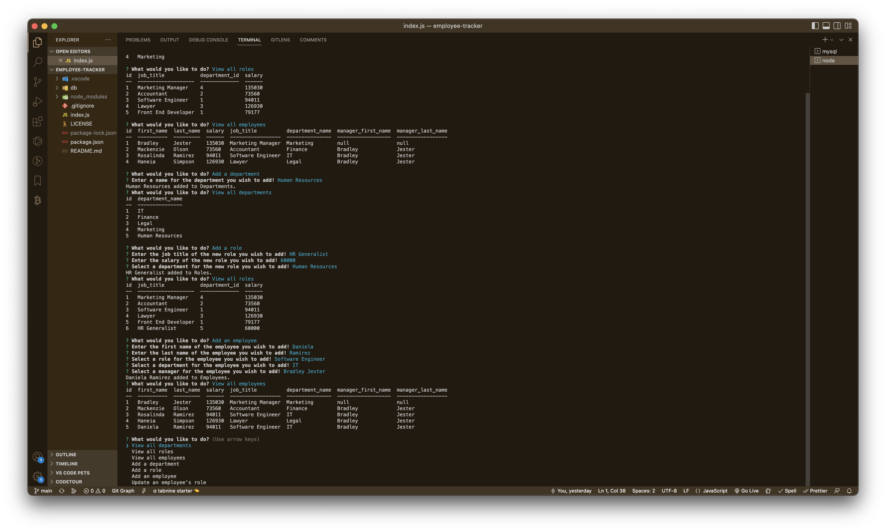
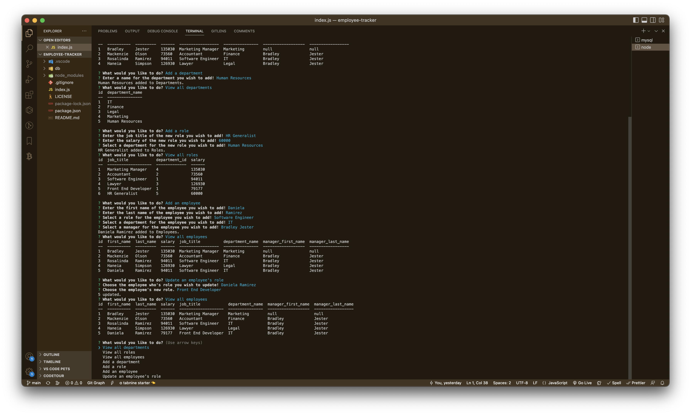

# SQL Challenge: Employee Tracker

## License

[This application is under the MIT license](https://opensource.org/licenses/MIT)

## Description

A command-line application to manage a company's employee database, using Node.js, Inquirer and MySQL.

- [SQL Challenge: Employee Tracker](#sql-challenge-employee-tracker)
  - [License](#license)
  - [Description](#description)
  - [Installation](#installation)
    - [Node.js Download Link](#nodejs-download-link)
    - [MySQL Download Link](#mysql-download-link)
  - [Usage](#usage)
    - [Terminal Screenshots](#terminal-screenshots)
    - [Walkthrough Video](#walkthrough-video)
  - [Contributing](#contributing)
  - [Tests](#tests)
  - [Questions](#questions)
    - [GitHub](#github)
    - [Email](#email)

<small><i><a href='http://ecotrust-canada.github.io/markdown-toc/'>Table of contents generated with markdown-toc</a></i></small>

## Installation

Clone the repository to your local machine and open the Employee Tracker command-line application in your code editor of choice (make sure to have Node.js and MySQL Shell downloaded, download links for both are below). To install the necessary dependencies, run `npm install` in the command-line terminal.

### Node.js Download Link

[Click here to install Node.js](https://nodejs.org/en/download/)

### MySQL Download Link

[Click here to install MySQL Shell](https://dev.mysql.com/downloads/shell/)

## Usage

### Terminal Screenshots

### Walkthrough Video

Click on the video link below to learn how to use the MySQL Employee Tracker command-line application:

[MySQL Employee Tracker Walkthrough Video Demonstration](assets/videos/employee-tracker-walkthrough-video.webm)

## Contributing

N/A

## Tests

N/A

## Questions

If you have any additional questions, you can reach me at:

### GitHub

[jesterb0206](https://www.github.com/jesterb0206)

### Email

jesterb@seattleu.edu
